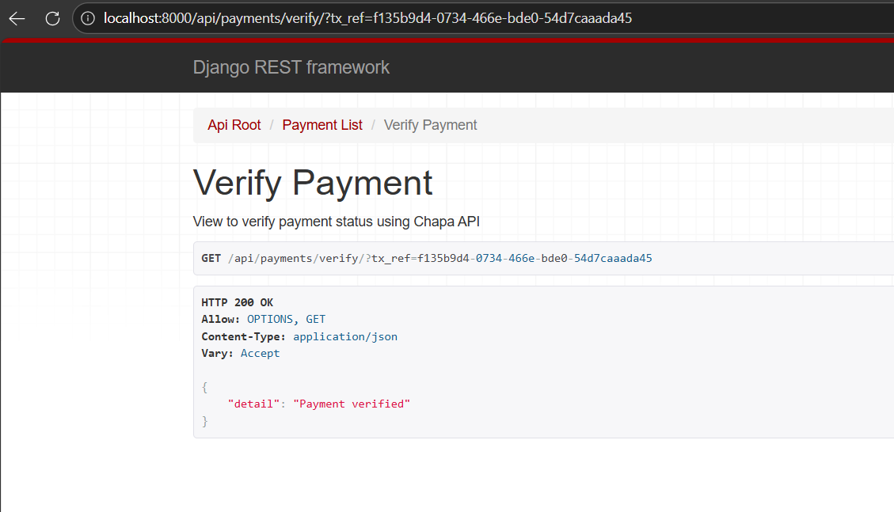
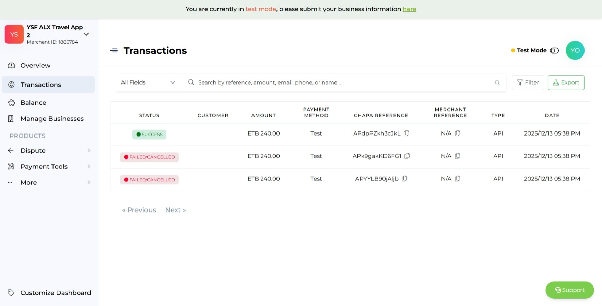
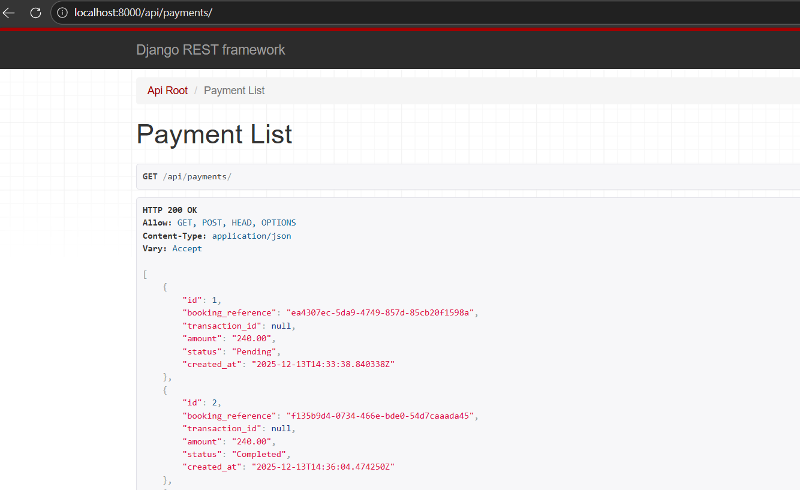

# Payment Integration - alx_travel_app_0x02

This project extends **alx_travel_app_0x01** by integrating **Chapa API** for payment processing. 

## Project Overview

- When a user creates a booking, a **Payment row** is automatically created in the backend.  
- The API returns in the response a **payment URL** that the user opens in the browser to complete the payment.  
- After payment completion, the backend **verifies the payment status** with Chapa and updates it (`Pending` → `Completed` or `Failed`).  
- Payments are associated with bookings via `booking_reference` (`tx_ref`).  

## First Test Screenshots

- **Payment Verification:** Screenshot of `GET /api/payments/verify/?tx_ref=f135b9d4-0734-466e-bde0-54d7caaada45` showing "Payment verified".  
- **Chapa Transactions:** Screenshot of Chapa sandbox transactions page showing the payment and its status.  
- **Payment Status:** Screenshot of all payments in the API showing the corresponding payment marked as `Completed`.

